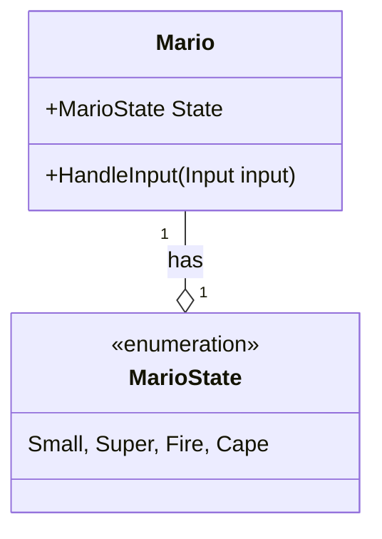
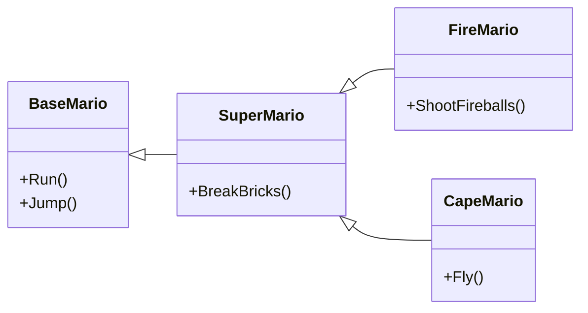
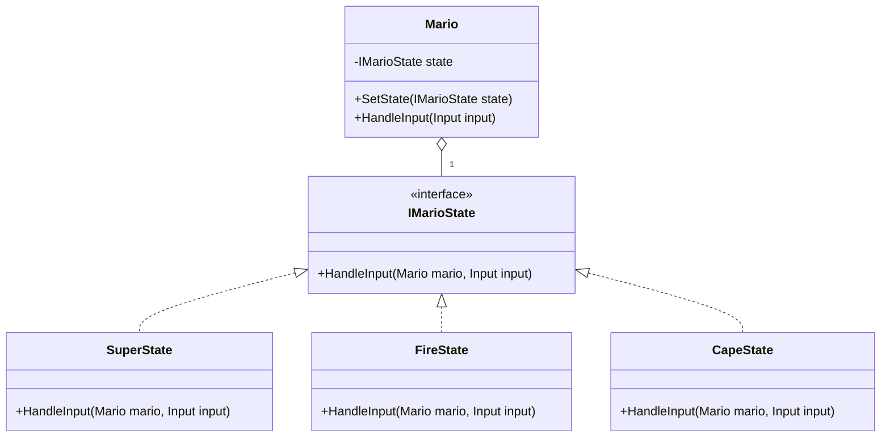
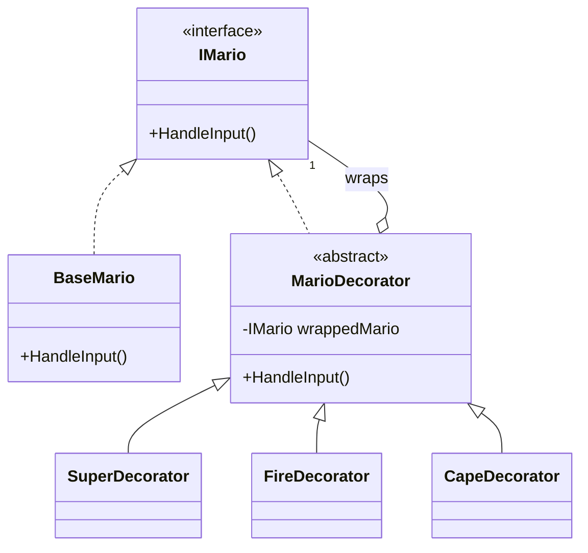

---
presentation:
  theme: league.css
  slideNumber: true
  parallaxBackgroundImage: https://ingloriouscoderz.it/_next/static/images/metal-wallpaper-236d3ad5bb71ea311f853ebb07099f75.jpg
  parallaxBackgroundSize: "2100px 900px"
  parallaxBackgroundHorizontal: 200
  parallaxBackgroundVertical: 50
---

<!-- slide -->

### F\#rragosto con JavaScript

## Inglorious Engine: Have fun(ctional programming) with it!

Matteo Antony Mistretta, Inglorious Coderz

<!-- slide -->

## It's-a me, Antony!


- I'm not a real gamer (I suck), but I have always been fascinated by the craft of games, which I consider one of the best forms of art nowadays.
- I myself love crafting elegant and scalable architectures. Games add an extra challenge.

<!-- slide -->

## Inglorious Engine


- I created **Inglorious Engine**, a headless, functional game engine in JS, to explore some of these ideas.
- Today, I want to share a different way of thinking about a common problem: managing state.

<!-- slide -->

## The Core Problem: Managing State

- Games are all about state: player position, health, score, inventory, and... power-ups.
- This state is constantly changing in complex ways.
- How we model and manage these state changes is one of the biggest challenges in game architecture.
- Let's use a classic example we all know and love: **Super Mario**.

<!-- slide -->

### The Super Mario Power-up Problem


<!-- slide -->

## State Transitions

- **Base Mario:** Can run and jump.
- **Super Mario** (Mushroom): Can break bricks.
- **Fire Mario** (Fire Flower): Can shoot fireballs.
- **Cape Mario** (Feather): Can fly.

How do we model this? How does Mario's behavior (what he _can do_) change when he gets a power-up? And crucially, how do we handle _combinations_ of states?

<!-- slide -->

## The OOP Way: A Quick Tour

In a statically-typed, object-oriented world like C#, we have some excellent, well-established patterns to solve this.

<!-- slide -->

### Option 1: The "God" Class



<br/>

<!-- slide -->

```csharp
public class Mario
{
    public enum MarioState { Small, Super, Fire, Cape }
    public MarioState State { get; set; }

    public void HandleInput(Input input)
    {
        switch (this.State)
        {
            case MarioState.Fire:
                // handle fire shooting...
                break;
            case MarioState.Cape:
                // handle flying...
                break;
            // etc.
        }
    }
}
```

<br/>

<!-- slide -->

- **Pros:** Simple for small games.
- **Cons:** Becomes a maintenance nightmare. Violates the Open/Closed Principle.

<!-- slide -->

### Option 2: Inheritance



<br/>

<!-- slide -->

```csharp
public class BaseMario {
  public void HandleInput(Input input) { ... }
}

public class SuperMario : BaseMario {
  public void HandleInput(Input input) {
    if (input.key === Input.DOWN) {
      this.BreakBrick();
    }

    super.HandleInput(input);
  }
}
public class FireMario : SuperMario { ... }
public class CapeMario : SuperMario { ... }
```

<br/>

<!-- slide -->

- **Pros:** Clear, strongly-typed hierarchy.
- **Cons:** Very rigid. How do we model a `FireCapeMario`, aka `UltraMario`? Multiple inheritance is messy or impossible (the "Diamond Problem"). State transitions (losing a power-up) are awkward—do we destroy the object and create a new one?

<!-- slide -->

### Option 3: The State/Strategy Pattern



<br/>

<!-- slide -->

```csharp
public class Mario
{
    public IMarioState State { get; set; }
    public void HandleInput(Input input) {
      this.State.HandleInput(this, input);
    }
}

public interface IMarioState
{
    void HandleInput(Mario mario, Input input);
}
public class SuperState : IMarioState { ... }
public class FireState : IMarioState { ... }
public class CapeState : IMarioState { ... }
```

<br/>

<!-- slide -->

- **Pros:** Great for state transitions. Decouples Mario from the state logic.
- **Cons:** Still a lot of boilerplate (interfaces, classes for each state). Combining states is still not straightforward.

<!-- slide -->

### Option 4: The Decorator Pattern



<br/>

<!-- slide -->

```csharp
IMario mario = new BaseMario();
mario = new SuperMario(mario);
mario = new FireDecorator(mario);
mario = new CapeDecorator(mario); // Ultra Mario!
```

<br/>

<!-- slide -->

This is my favorite OOP solution and gets very close to what I want to show you.

- **Pros:** Very flexible, allows for runtime composition.
- **Cons:** Can lead to many small classes. Object identity can get confusing. It's still very "class-heavy."

<!-- slide -->

## A Different Perspective: Composition over Inheritance

What if we stopped thinking about "what Mario **is**" (a class) and started thinking about "what he **can do**" (a collection of behaviors)?

This is the core idea of **Data-Oriented Programming** and **Functional Programming**.

In Inglorious Engine, an entity is just data, and its behavior is defined by a collection of functions.

<!-- slide -->

### Entities are Data, Behaviors are Functions

- An **entity** is a plain object holding state.
- A **behavior** is an object containing event handler functions.
- An entity's **type** is just an array of these behavior objects.

```javascript
// A behavior for basic movement
const controls = { update: move, inputPress: jump }

// A behavior for shooting fireballs
const firePower = { inputPress: shootFireball }

// Mario's type is a composition of behaviors
const marioType = [controls, firePower]
```

<br/>

<!-- slide -->

### The "Aha!" Moment: Functional Decorators

If a `type` is just an array of behaviors, we can "decorate" an entity by adding new behaviors to that array at runtime.

This is the **Decorator Pattern**, reimagined with simple function composition.

```javascript
// Base Mario
let marioBehaviors = [baseMovement, jump]
// When he gets a fire flower... We decorate his behavior array!
marioBehaviors = [...marioBehaviors, firePower]
// Ultra Mario? Just add another decorator.
marioBehaviors = [...marioBehaviors, capePower]
```

<br/>

<!-- slide -->

## The JavaScript Advantage: Dynamic by Nature

There's another piece to this that's powerful. In C#, you'd need to define `CanFly` and `CanShootFire` on the `Mario` class beforehand.

In JavaScript, objects are dynamic. You can add or remove properties at any time.

<!-- slide -->

Consider a temporary "invincibility star" power-up.

```javascript
// Mario doesn't have an 'invincible' property to start.
// He hits a star...
mario.invincible = { duration: 10 } // We just added it!

// In the game loop (the 'update' event):
if (mario.invincible) {
  mario.invincible.duration -= dt // dt is delta time
  if (mario.invincible.duration <= 0) {
    delete mario.invincible // The property is gone!
  }
}
```

This allows for incredible flexibility and rapid prototyping of emergent mechanics.

<!-- slide -->

## The Redux Advantage

The architecture of Inglorious Engine is heavily inspired by [Redux](https://redux.js.org/), which gives us some major advantages, many of which will feel familiar to web developers.


<!-- slide -->

- **Predictable State Flow:** The entire game lives in a single state object. The only way to change it is to dispatch an event. This makes the flow of data incredibly predictable.

<!-- slide -->

- **Simple Logic, Safe Updates:** You write simple code that _looks_ like you're mutating objects. The engine uses [Mutative](https://mutativejs.github.io/mutative/) to handle the complex immutable updates for you, giving you simple code and the safety of immutability.

<!-- slide -->

- **Unparalleled Debugging:** Because state is a single, immutable object, you can implement **time-travel debugging** to step backward and forward through state changes to find exactly when a bug was introduced.

<!-- slide -->

- **Trivial Testability:** An event handler is just a function that takes state and an event, and returns new state. You can test your game logic without complex mocks. Just pass in data and assert on the output.

<!-- slide -->

- **Simplified Networking:** For multiplayer games, you just send small, serializable `event` objects over the network. Each client processes the same events, guaranteeing their game states stay in sync.

<!-- slide -->

## Adapting Redux for Games

The engine's state management is inspired by Redux, but it's not a direct copy. We've made crucial adaptations specifically for game development.

<!-- slide -->

- **1. Events, not Actions:** Instead of "dispatching an action", we "notify of an event". Event handlers are named for the event they react to (e.g., `playerMove`, `enemyDestroy`), similar to standard JavaScript event handlers like `onClick`. It's a natural fit for game logic.

<!-- slide -->

- **2. Asynchronous Event Queue:** Unlike Redux's synchronous dispatch, events are added to a queue and processed once per frame. This provides determinism, prevents mid-frame state changes, and is essential for a stable game loop.

<!-- slide -->

- **3. Handlers Can Issue New Events:** This is the biggest departure from pure Redux. A handler for one event (like `enemyTakeDamage`) can notify of a _new_ event (like `enemyDie`). Thanks to the queue, this is a safe and powerful way to create reactive logic chains like `playerAttackHit` -> `enemyTakeDamage` -> `enemyDie` -> `playerGainXp`.

<!-- slide -->

## Summary

- We looked at familiar OOP patterns for managing state (God Class, Inheritance, State, Decorator).
- We saw how a **functional, data-oriented** approach simplifies this by treating:
  - Entities as **data**.
  - Behaviors as **functions**.
- **Function Composition** becomes a natural, simple, and powerful alternative to inheritance for creating complex behaviors.
- JavaScript's **dynamic nature** adds another layer of flexibility, freeing us from rigid class structures.

<!-- slide -->

## Dive Deeper

- **Live Documentation:** The engine is fully documented with live, interactive examples.
- **Quick Start Guide:** You can get a game running in under 30 seconds.
- **Core Concepts:** Explains all the principles we discussed today in more detail.
- **It's Open Source!** The code for the engine and the documentation is all on GitHub. We welcome contributions!

<!-- slide -->

## Thank You & Q&A

- **Docs:** https://inglorious-engine.vercel.app/
- **Source:** https://github.com/IngloriousCoderz/inglorious-forge
- **Contact/Socials:** https://www.linkedin.com/in/antonymistretta/
